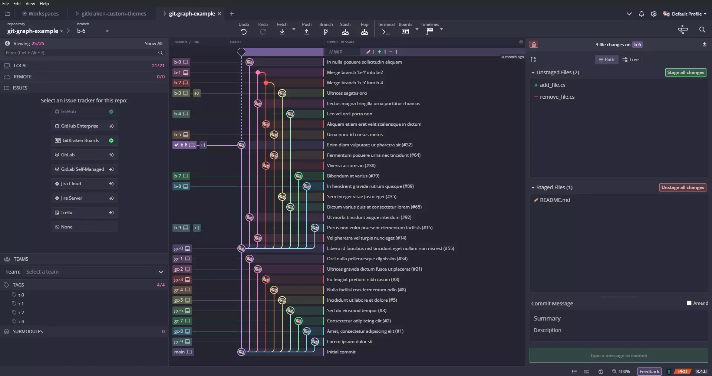
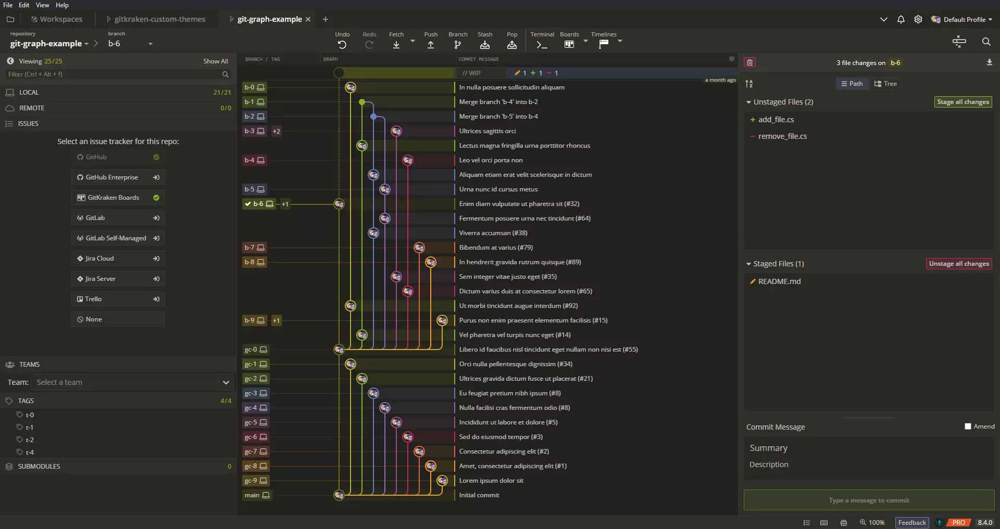
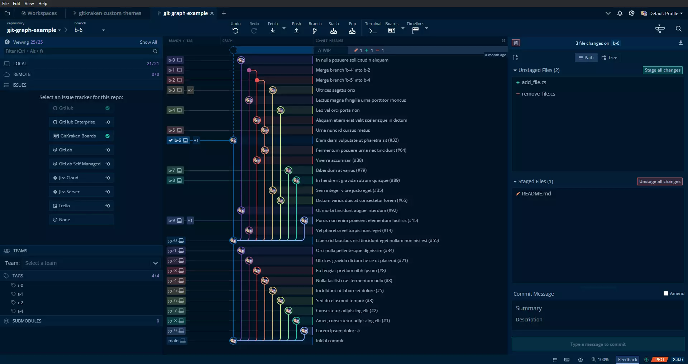
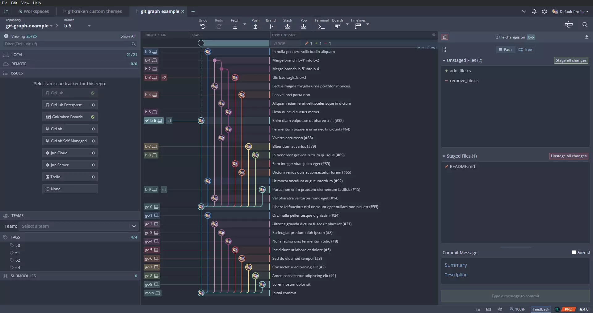
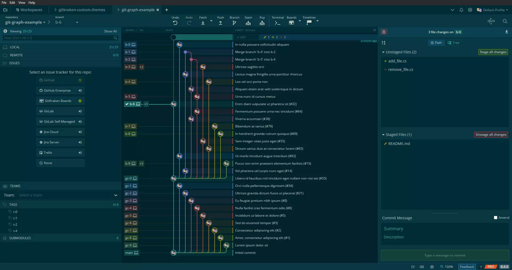
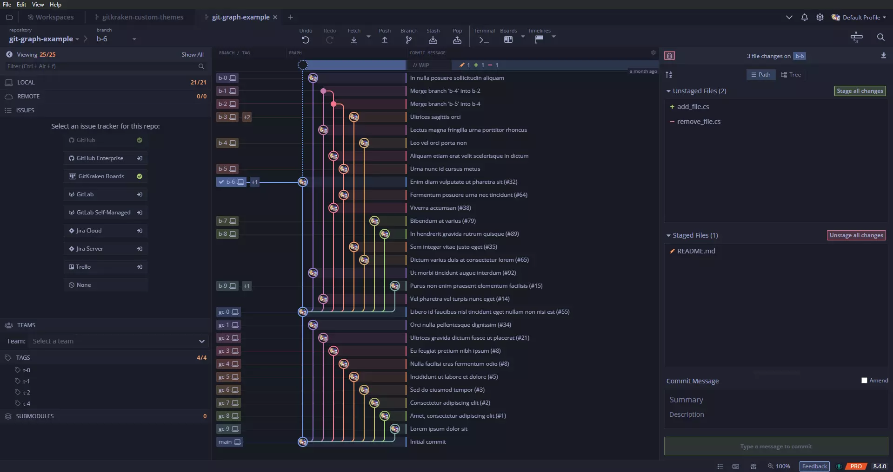
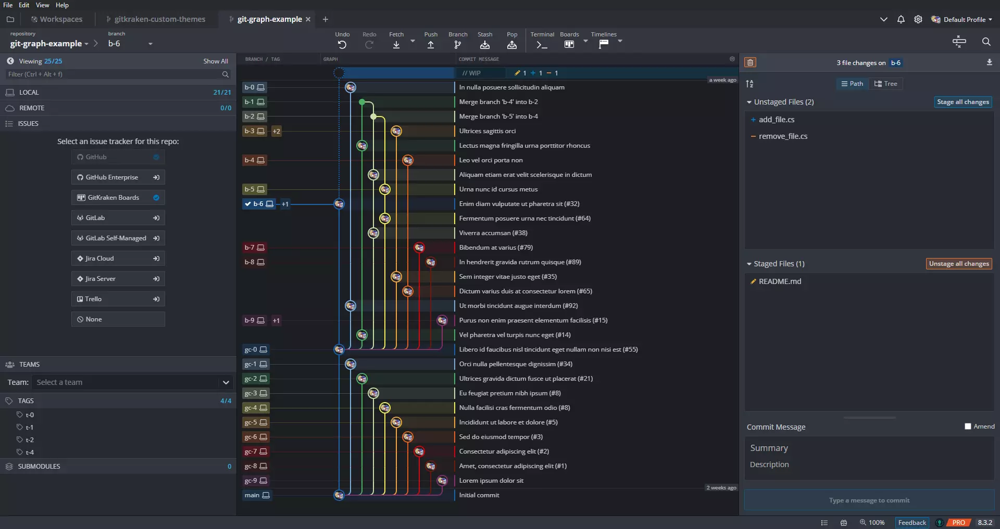
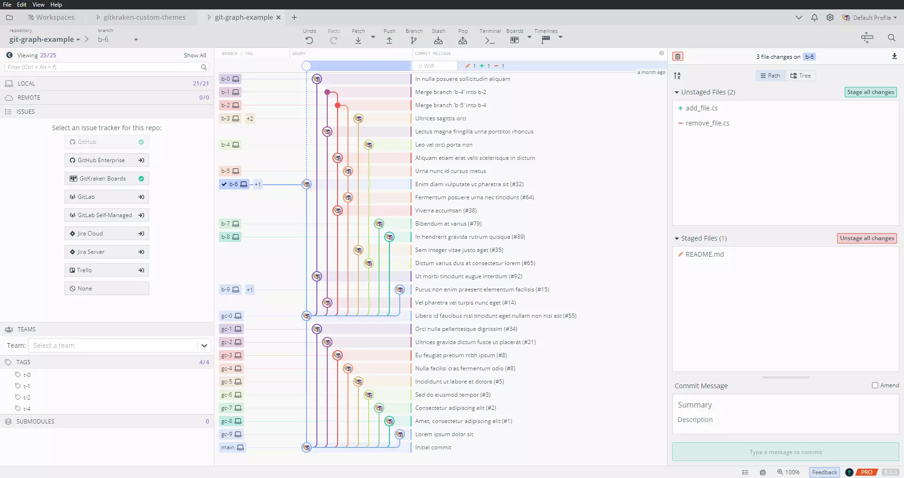
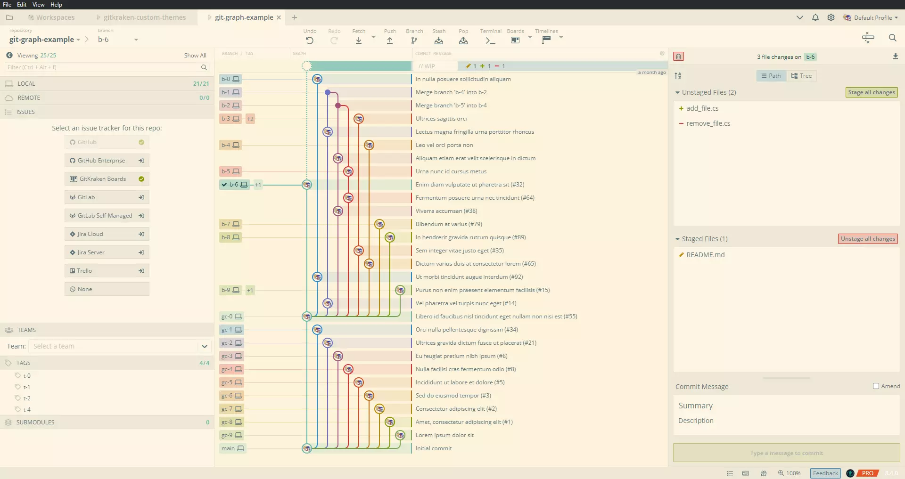

# 
# Collection of custom themes for [GitKraken](https://www.gitkraken.com/)
Give your GitKraken client a whole new look with these custom themes. Note that this repository is not an official GitKraken repository.

# Installation
- You can find all available themes in the [Themes](https://github.com/JonBunator/gitkraken-custom-themes/tree/master/Themes) folder.
- Copy the \*.jsonc file of your desired theme in your GitKraken theme folder. On Windows it's usually located at: `C:\Users\Username\AppData\Roaming\.gitkraken\themes`.
- Select your theme under `Preferences -> UI Customization`.
- See also the official GitKraken [Documentation](https://support.gitkraken.com/start-here/themes/).

# Dark Themes
## [Dracula](https://github.com/JonBunator/gitkraken-custom-themes/tree/master/Themes/Dracula) - ([Source](https://draculatheme.com/))
# 

## [Monokai](https://github.com/JonBunator/gitkraken-custom-themes/tree/master/Themes/Monokai) - ([Source](https://github.com/microsoft/vscode/blob/main/extensions/theme-monokai/themes/monokai-color-theme.json))
# 

## [Night Owl](https://github.com/JonBunator/gitkraken-custom-themes/tree/master/Themes/NightOwl) - ([Source](https://github.com/sdras/night-owl-vscode-theme))
# 

## [Nord](https://github.com/JonBunator/gitkraken-custom-themes/tree/master/Themes/Nord) - ([Source](https://www.nordtheme.com/))
# 

## [Solarized](https://github.com/JonBunator/gitkraken-custom-themes/tree/master/Themes/Solarized) - ([Source](https://github.com/altercation/solarized))
# 

## [Tokyo Night](https://github.com/JonBunator/gitkraken-custom-themes/tree/master/Themes/TokyoNight) - ([Source](https://github.com/enkia/tokyo-night-vscode-theme), [Based on](https://github.com/remondevries/tokyonight-gitkraken-theme/))
# 

## [GitKraken-Dark Color Blind](https://github.com/JonBunator/gitkraken-custom-themes/blob/master/Themes/Default%20Themes%20Modified) - ([Source](https://personal.sron.nl/~pault))
# 

# Light Themes
## [Light Owl](https://github.com/JonBunator/gitkraken-custom-themes/tree/master/Themes/NightOwl) - ([Source](https://github.com/sdras/night-owl-vscode-theme))
# 

## [Solarized](https://github.com/JonBunator/gitkraken-custom-themes/tree/master/Themes/Solarized) - ([Source](https://github.com/altercation/solarized))
# 

# Contributions
Contributions are always welcome. New themes should not be too similar to other themes in this repository and should look good.
