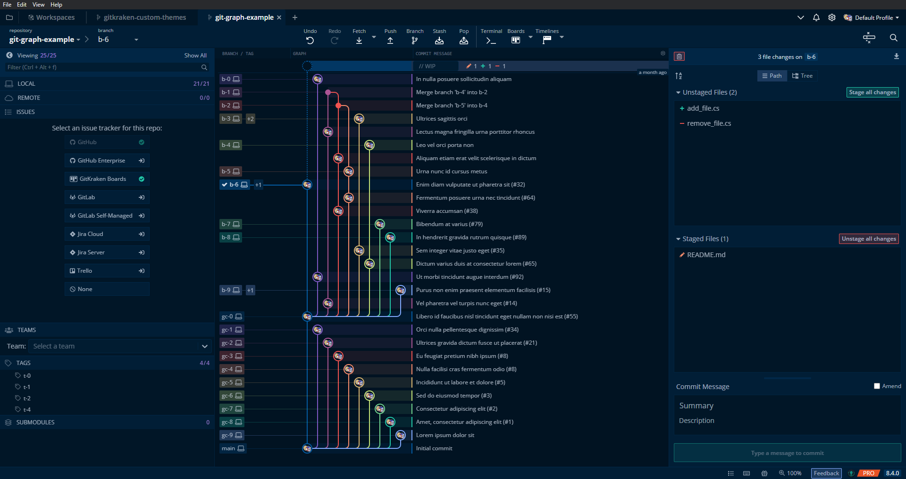
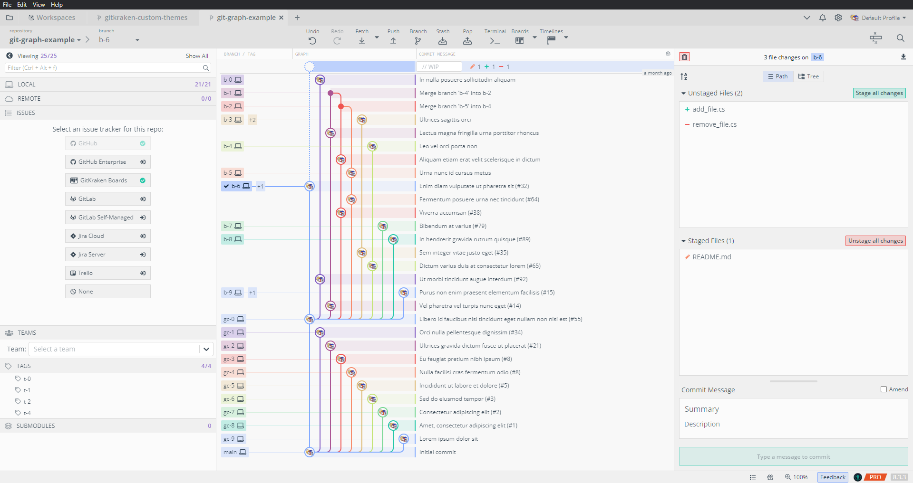
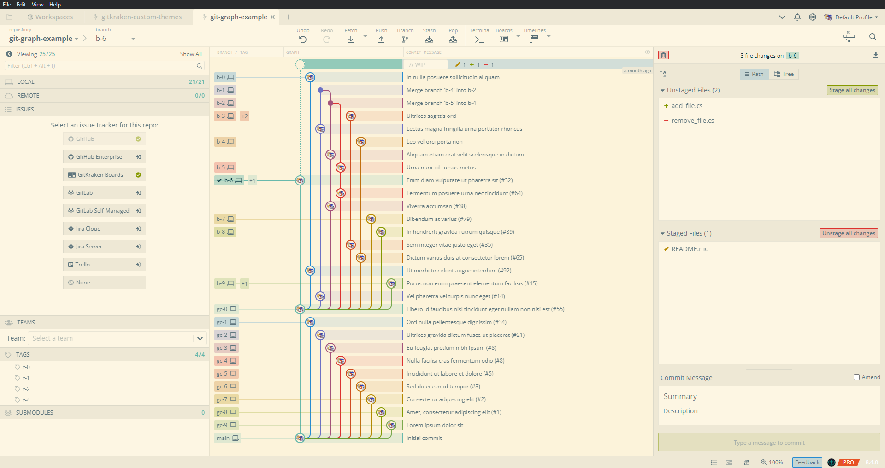

# Collection of custom themes for [GitKraken](https://www.gitkraken.com/)
Give your GitKraken client a whole new look with these custom themes. Note that this repository is not an official GitKraken repository.

# Table of Contents
- [Installation](#installation)
- [Dark Themes](#dark-themes)
  - [Dracula](#dracula---source)
  - [FranticDreamer's Crimson](#franticdreamers-crimson---made-by-edgarbarney)
  - [Monochrome](#monochrome)
  - [Monokai](#monokai---source)
  - [Night Owl](#night-owl---source)
  - [Nord](#nord---source)
  - [Oled Dream](#oled-dream--made-by-nextdoorpsycho)
  - [OneDark](#onedark---source)
  - [Poimandres](#poimandres---source-made-by-sebbev)
  - [Solarized](#solarized---source)
  - [Tokyo Night](#tokyo-night---source-made-by-remondevries)
  - [1984](#1984---source)
  - [GitKraken-Dark Color Blind](#gitkraken-dark-color-blind---source)
- [Light Themes](#light-themes)
  - [Light Owl](#light-owl---source)
  - [Solarized](#solarized---source-1)
  - [GitKraken-Light Color Blind](#gitkraken-light-color-blind---source)
- [Other Themes](#other-themes)
- [Contributions](#contributions)

# Installation
- You can find all available themes in the [Themes](https://github.com/JonBunator/gitkraken-custom-themes/tree/master/Themes) folder.
- Copy the \*.jsonc file of your desired theme in your GitKraken theme folder. On Windows it's usually located at: `C:\Users\Username\AppData\Roaming\.gitkraken\themes`. While for macOS, it's located at `/Users/$USER/.gitkraken/themes`.
- Select your theme under `Preferences -> UI Customization`.
- See also the official GitKraken [Documentation](https://support.gitkraken.com/start-here/themes/).

# Dark Themes
## [Dracula](https://github.com/JonBunator/gitkraken-custom-themes/tree/master/Themes/Dracula) - ([Source](https://draculatheme.com/))

## [FranticDreamer's Crimson](https://github.com/JonBunator/gitkraken-custom-themes/tree/master/Themes/FranticDreamersCrimson) - (made by [edgarbarney](https://github.com/edgarbarney))

## [Monochrome](https://github.com/JonBunator/gitkraken-custom-themes/tree/master/Themes/Monochrome)

## [Monokai](https://github.com/JonBunator/gitkraken-custom-themes/tree/master/Themes/Monokai) - ([Source](https://github.com/microsoft/vscode/blob/main/extensions/theme-monokai/themes/monokai-color-theme.json))

## [Night Owl](https://github.com/JonBunator/gitkraken-custom-themes/tree/master/Themes/NightOwl) - ([Source](https://github.com/sdras/night-owl-vscode-theme))

## [Nord](https://github.com/JonBunator/gitkraken-custom-themes/tree/master/Themes/Nord) - ([Source](https://www.nordtheme.com/))

## [Oled Dream](https://github.com/JonBunator/gitkraken-custom-themes/tree/master/Themes/Oled%20Dream)- (made by [NextdoorPsycho](https://github.com/NextdoorPsycho))

## [OneDark](https://github.com/JonBunator/gitkraken-custom-themes/tree/master/Themes/OneDark) - ([Source](https://github.com/atom/atom/tree/master/packages/one-dark-syntax))

## [Poimandres](https://github.com/JonBunator/gitkraken-custom-themes/tree/master/Themes/Poimandres) - ([Source](https://github.com/drcmda/poimandres-theme), made by [Sebbev](https://github.com/Sebbev))

## [Solarized](https://github.com/JonBunator/gitkraken-custom-themes/tree/master/Themes/Solarized) - ([Source](https://github.com/altercation/solarized))

## [Tokyo Night](https://github.com/JonBunator/gitkraken-custom-themes/tree/master/Themes/TokyoNight) - ([Source](https://github.com/enkia/tokyo-night-vscode-theme), made by [remondevries](https://github.com/remondevries))

## [1984](https://github.com/JonBunator/gitkraken-custom-themes/tree/master/Themes/1984) - ([Source](https://github.com/juanmnl/vs-1984))

## [GitKraken-Dark Color Blind](https://github.com/JonBunator/gitkraken-custom-themes/blob/master/Themes/Default%20Themes%20Modified) - ([Source](https://sronpersonalpages.nl/~pault))

# Light Themes
## [Light Owl](https://github.com/JonBunator/gitkraken-custom-themes/tree/master/Themes/NightOwl) - ([Source](https://github.com/sdras/night-owl-vscode-theme))

## [Solarized](https://github.com/JonBunator/gitkraken-custom-themes/tree/master/Themes/Solarized) - ([Source](https://github.com/altercation/solarized))

## [GitKraken-Light Color Blind](https://github.com/JonBunator/gitkraken-custom-themes/blob/master/Themes/Default%20Themes%20Modified) - ([Source](https://sronpersonalpages.nl/~pault))

# Other Themes
- [Catppuccin (Official)](https://github.com/catppuccin/gitkraken)
- [Dracula (Official)](https://github.com/dracula/gitkraken)

# Contributions
Contributions are always welcome. New themes should not be too similar to other themes in this repository and should look good.

Thanks to everyone that has contributed so far!

