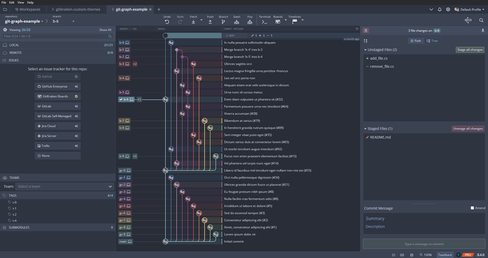

# 
# Collection of custom themes for [GitKraken](https://www.gitkraken.com/)
Give your GitKraken client a whole new look with these custom themes. Note that this repository is not an official GitKraken repository.

# Installation
- You can find all available themes in the [Themes](Themes) folder.
- Copy the \*.jsonc file of your desired theme in your GitKraken theme folder. On Windows it's usually located at: `C:\Users\Username\AppData\Roaming\.gitkraken\themes`.
- Select your theme under `Preferences -> UI Customization`.
- See also the official GitKraken [Documentation](https://support.gitkraken.com/start-here/themes/).

# All themes
## [Dracula](Themes/Dracula) - ([Source](https://draculatheme.com/))
# 

## [Nord](Themes/Nord) - ([Source](https://www.nordtheme.com/))
# 

## [Solarized](Themes/Solarized) - ([Source](https://github.com/altercation/solarized#features))
# 

# Contributions
Contributions are always welcome. New themes should not be too similar to other themes in this repository and should look good.
